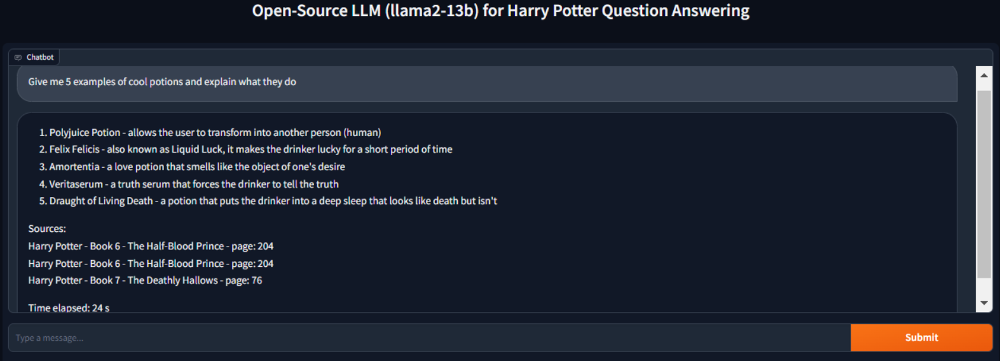

## Harry Potter Retrieval-Augmented Question Answering Chatbot Using LangChain, FAISS, and Hugging Face Model

This project implements a document-based question answering system capable of processing and understanding PDF content from the Harry Potter book series. The system utilizes a Retrieval-Augmented Generation (RAG) pipeline, where documents are first read and split into manageable text chunks. These chunks are then converted into dense vector representations using the BAAI/bge-small-en-v1.5 embedding model, which is specifically optimized for information retrieval tasks.

The vector embeddings are indexed using FAISS, enabling efficient similarity search. When a user submits a question, the system generates an embedding for the query using the same model and retrieves the top-k most relevant text chunks from the vector database. These retrieved chunks, along with the question, are passed to a large language model (e.g., llama2-13b-chat) to generate a context-aware and accurate answer.

The pipeline is built using LangChain, which simplifies integration of document loaders, embedding models, vector stores, prompt templates, and LLMs. The system supports efficient inference using 4-bit quantized models via bitsandbytes to reduce memory consumption.

